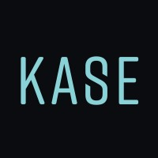
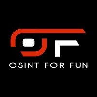
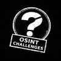

# OSINT CTFs

In this repository, you will find Capture The Flag platforms that will help you improve your OSINT skills and make new friends in the OSINT community (some of them are team-based). 

| Logo             | Name             | Link          |  Social Media  | 
|------------------|------------------|-------------------------| -------------|
|| OSINT Industries CTF | https://ctf.osint.industries/  | [Linkedin](https://www.linkedin.com/company/osint-industries/) |
|| TryHackMe CTFs (many different OSINT rooms)  | https://tryhackme.com/room/ohsint |   [Linkedin](https://www.linkedin.com/company/tryhackme/) |
|| Hacktoria | https://hacktoria.com/  |    [Linkedin](https://www.linkedin.com/company/hacktoriactf/) |
|| HHS OSINT CTF | https://hhs.ninja/ |  [LinkedIN](https://www.linkedin.com/company/happyhackingspace) |
|| Diver OSINT CTF  | https://diverctf.org/en.html   | [Twitter](https://x.com/DIVER_OSINT_CTF) |
|| Maltego Community CTF  | https://www.maltego.com/community-ctf/ |    [Linkedin](https://www.linkedin.com/company/maltego/) |
| | Gralhix (Sofia Santos) OSINT Analysis & Exercises  | https://gralhix.com/ | [Linkedin](https://www.linkedin.com/in/sofia-santos-/) |
|| Bellingcat Open Source Challenge | https://challenge.bellingcat.com/  | [Linkedin](https://www.linkedin.com/company/bellingcat/) |
|| OSMOSIS CTF | https://osmosis.ctfd.io/  | [Linkedin](https://linkedin.com/company/osmosis-association) |
|| Kase Scenarios | https://kasescenarios.com/  | [Linkedin](https://www.linkedin.com/company/kase-scenarios/) |
|| OSINT for FUN | https://en.osint4fun.eu/challenges/ | [Linkedin](https://www.linkedin.com/company/osint4fun/) |
|| UK OSINT CTF | https://ctf.osint.uk/| [Linkedin](https://www.linkedin.com/company/osintuk/posts/?feedView=all) |
|| OSINT Challenges| https://osintchallenges.com/ | [Linkedin](https://www.linkedin.com/company/osint-challenges/posts/) |
|| OSINTTOPIA| https://osintopia.fr/ | [Linkedin](https://www.linkedin.com/company/osintopia/about/) |

If you are have your own OSINT CTF, feel free to request that it be added to this repository!

Use Issues or the contact details on the main page of Ubikron's Github profile.

## Our other repositories

[Ubikron Advanced Enrichments](https://github.com/ubikron/Advanced-Enrichments)  
[Awesome AI OSINT](https://github.com/ubikron/Awesome-AI-OSINT)  
[Awesome OSINT Chrome Extensions](https://github.com/ubikron/awesome-osint-chrome-extensions)  
[OSINT People](https://github.com/ubikron/OSINT-People)  
[OSINT Companies](https://github.com/ubikron/OSINT-Companies)  
[OSINT Newsletters](https://github.com/ubikron/OSINT-newsletters)  
[OSINT Books](https://github.com/ubikron/OSINT-Books)  
[OSINT Conferences](https://github.com/ubikron/OSINT-Conferences)

-----

Don't miss our updates!   
[Linkedin](https://www.linkedin.com/company/ubikron/)    
[YouTube](https://www.youtube.com/@ubikron)  

